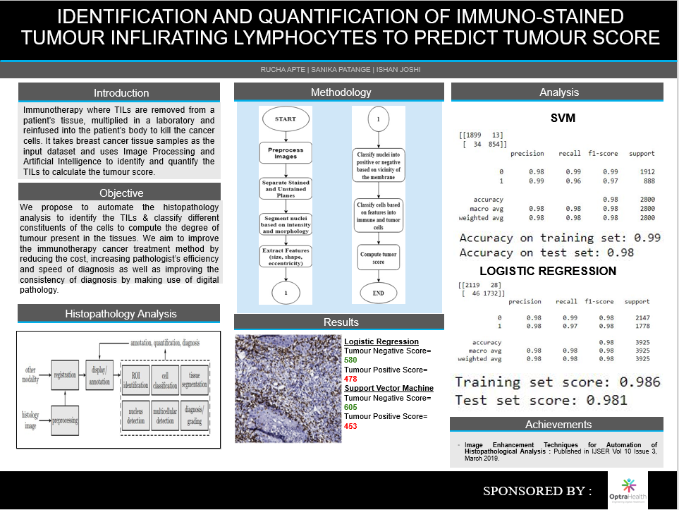

# Identification-of-Immune-Stained-TILs-to-predict-the-Tumor-Score

Tumour Infiltrating Lymphocytes (TILs) are T-cells that have the ability to migrate towards the tumor and shrink it. This project automates the entire process of histopathology analysis by harnessing the power of digital pathology.

Initially, pathologists used to zoom in on the slide of tissue and count the actual number of TILs present in the tissue. However, this method led to a large amount of bias and errors due to fatigue, which resulted in declined efficiency.

In order to avoid this, breast tissue slides stained with IHC are scanned and stored using OptraScan and using different techniques in Machine Learning and Image Processing, this project is able to quantify the tumor positive and tumor negative score with an accuracy of 98.6%.

The overview of the project can be given by the following image:

